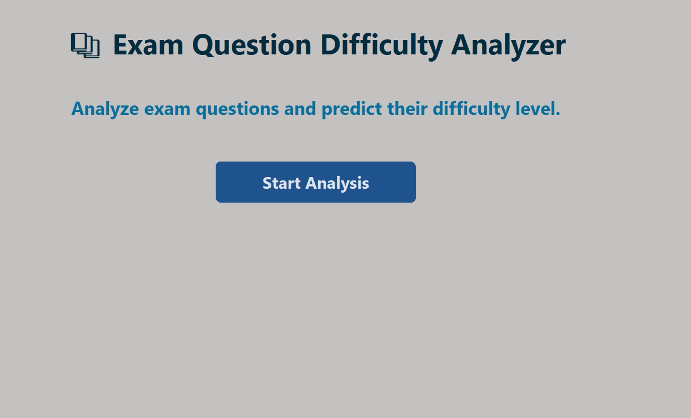
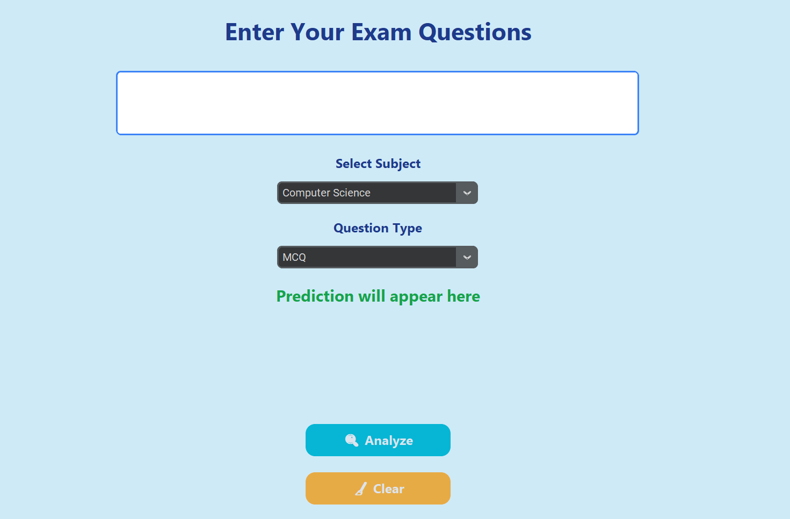

# 📚 Exam Question Difficulty Analyzer

## 📖 Overview

The Exam Question Difficulty Analyzer is a Python desktop application that predicts whether an exam question is Easy, Medium, or Hard based on the entered question.

The application provides a simple and user-friendly graphical interface built with CustomTkinter.

---

## Features

- 📚 Modern and attractive GUI
- ✍️ Enter exam questions manually
- 📖 Subject selection
- 📝 Question type selection
- 🔍 Difficulty prediction
- 🧹 Clear input and results
- 🎨 Professional interface using CustomTkinter

---

## Technologies Used

- Python
- CustomTkinter
- VS Code

---

## How to Run

1. Clone the repository.
2. Open the project in VS Code.
3. Install CustomTkinter.
4. Run:

bash
python main.py

---

## 📂 Project Structure

Exam-Question-Difficulty-Analyzer/
│
├── main.py
├── model.py
├── utils.py
├── questions.csv
├── requirements.txt
├── README.md
│
└── screenshots/
    ├── main-screen.png
    ├── question-analyzer.png
    ├── question-analyzer-2.png
    ├── prediction-result.png
    └── prediction-result-2.png

---

## 📸 Screenshots

### Main Screen

### Question Analyzer

### Question Analyzer 2

### Prediction Result

### Prediction Result 2

## Author

Sidra Khan

AI & Machine Learning Student
